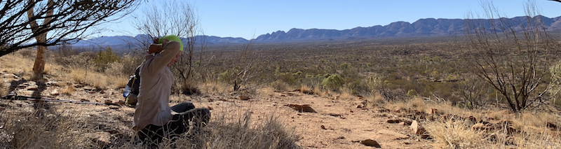

# ⛺️ westmacsapp-graphql-server

express + express-graphql + postgres + postgis



That's me sitting right [here](https://www.google.com/maps/place/23%C2%B046'23.3%22S+133%C2%B005'51.3%22E/@-23.7731361,133.0954057,808m/data=!3m1!1e3!4m5!3m4!1s0x0:0x0!8m2!3d-23.7731361!4d133.0975944)

## What is this?

GraphQL api server for Larapinta Trail data, observations and geometry. In progress...I will make this look more adult shortly...

## What can you do with this

Not too much until I release a distribution. I'm looking at one big Docker she-bang. Fo teh lolz.

## ⛺️ Hot finds...

Map Postgis Point:

````JavaScript
var CoordinateType = new GraphQLObjectType({
    name: 'Coordinate',
    fields: () => ({
      x: {
        type: GraphQLFloat,
        description: 'The x.',
      },
      y: {
        type: GraphQLFloat,
        description: 'The y.',
      }
    })
  });

const LocationType = new GraphQLObjectType({
  name: "Location",
  type: "Query",
  fields: {
    id: { type: GraphQLString },
    coords: { type: CoordinateType},
    elevation: { type: GraphQLString }
  }
});
````

<br>

<hr>

*rrr@<span></span>burntsugar.rocks*